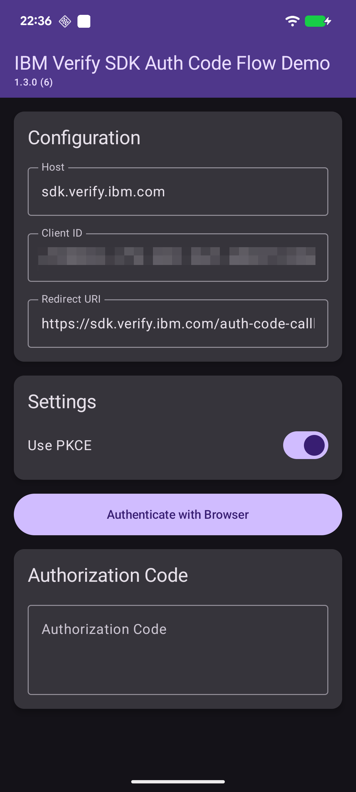
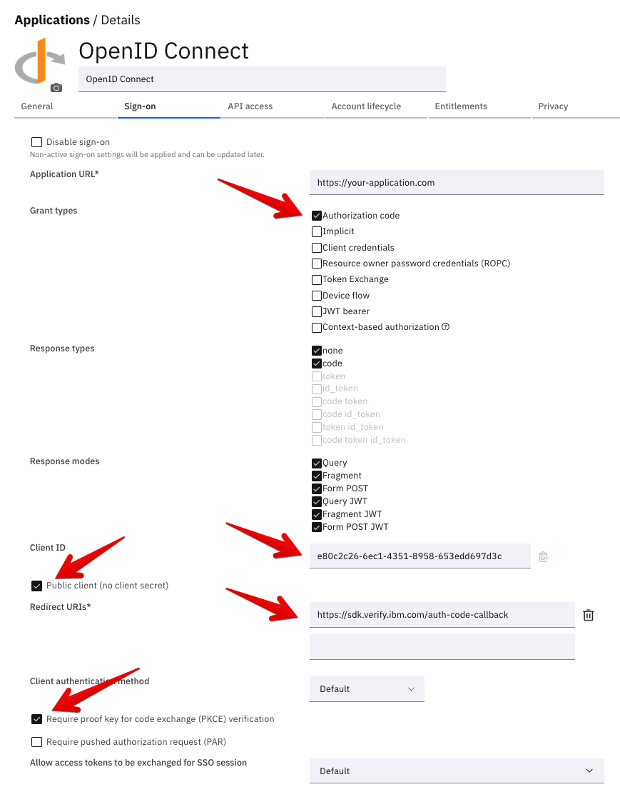
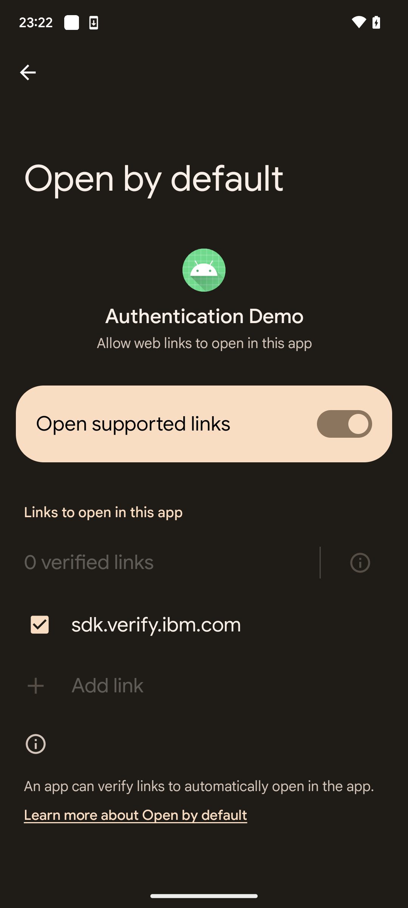

# Oauth Authorization Code Flow Demo

<!-- TOC -->
- [Oauth Authorization Code Flow Demo](#oauth-authorization-code-flow-demo)
  - [Features](#features)
  - [Setup](#setup)
    - [IBM Verify](#ibm-verify)
    - [Mobile app](#mobile-app)
    - [Deep Link Configuration (OAuth redirect handling)](#deep-link-configuration-oauth-redirect-handling)
      - [1. Gradle Build Configuration (`build.gradle.kts`)](#1-gradle-build-configuration-buildgradlekts)
      - [2. Android Manifest Configuration (`AndroidManifest.xml`)](#2-android-manifest-configuration-androidmanifestxml)
      - [Testing without assetlinks.json](#testing-without-assetlinksjson)
      - [Production setup with assetlinks.json](#production-setup-with-assetlinksjson)
    - [How it works](#how-it-works)
  - [Usage](#usage)
    - [Common Issues](#common-issues)
<!-- /TOC -->
----

This demo application demonstrates OAuth 2.0 Authorization Code Flow with optional PKCE support and OIDC for Open Banking.

It uses the system browser to run the OAuth authorization code flow rather than an in-app WebView because the browser provides a trusted, isolated environment the app cannot tamper with. This protects users from credential interception, ensures they see the familiar login experience from their identity provider



## Features

- **OAuth 2.0 Authorization Code Flow** - Standard OAuth 2.0 authorization
- **PKCE Support** - Optional Proof Key for Code Exchange for enhanced security
- **OIDC for Open Banking** - Support for OpenID Connect Open Banking endpoints
- **Dual Endpoint Support**:
  - Standard OAuth: `/v1.0/endpoint/default/authorize` and `/v1.0/endpoint/default/token`
  - OIDC Open Banking: `/oauth2/authorize` and `/oauth2/token`
- **Dynamic Client ID Selection** - Automatically uses the appropriate client ID based on selected mode
- **Browser-based Authentication** - Secure authentication via system browser
- **Token Exchange** - Automatic token retrieval after authorization
- **Debug Logging** - Comprehensive logging via SLF4J for troubleshooting

## Setup

### IBM Verify

- Login to your Verify tenant
- Go to 'Applications' -> 'Applications'
- Open the app that you want to configure or add a new "Open ID Connect" application
- Go to 'Sign-on' tab
- Configure the following attributes:
  - Application URL
  - Grant types: select `Authorization code`
  - Client ID: gets auto-generated when saving
  - Public client: select it
  - Redirect URIs
  - Require PKCE: select it



`Client ID` and the redirect url are needed in the following configuration steps for the mobile app.

### Mobile app

Before running the app, you need to create a configuration file:

1. Navigate to `src/main/assets/`
2. Copy `config.properties.sample` to `config.properties`
3. Update the values in `config.properties` with your OAuth server details:

```properties
host=your-oauth-server.com
clientId=your-client-id (from the previous step)
redirect=https://your-oauth-server.com/callback (from the previous step)
```

### Deep Link Configuration (OAuth redirect handling)

The app uses Android App Links to handle OAuth redirect callbacks. The configuration happens in two places:

#### 1. Gradle Build Configuration (`build.gradle.kts`)

The `redirect` URL from `config.properties` is automatically parsed at build time and injected via Gradle into the AndroidManifest file:

```kotlin
android {
    defaultConfig {
        // Inject as manifest placeholders
        manifestPlaceholders["auth_redirect_scheme"] = redirectScheme
        manifestPlaceholders["auth_redirect_host"] = redirectHost
        manifestPlaceholders["auth_redirect_path"] = redirectPath
    }
}
```

#### 2. Android Manifest Configuration (`AndroidManifest.xml`)

The manifest placeholders are used to configure the intent filter for deep links:

```xml
<activity
    android:name="com.ibm.security.verifysdk.authentication.AuthenticationActivity"
    android:exported="true"
    android:launchMode="singleTop"
    tools:node="merge">
    <intent-filter android:autoVerify="true">
        <action android:name="android.intent.action.VIEW" />
        <category android:name="android.intent.category.DEFAULT" />
        <category android:name="android.intent.category.BROWSABLE" />
        <data
            android:scheme="${auth_redirect_scheme}"
            android:host="${auth_redirect_host}"
            android:path="${auth_redirect_path}"
            />
    </intent-filter>
</activity>
```

**Key Configuration Details:**

- **`android:exported="true"`** - Allows external apps (browser) to launch this activity
- **`android:launchMode="singleTop"`** - Prevents creating multiple instances of the activity
- **`android:autoVerify="true"`** - Enables Android App Links (requires assetlinks.json for production)
- **`tools:node="merge"`** - Merges this configuration with the SDK's default AuthenticationActivity

#### Testing without assetlinks.json

For development and testing, you can bypass the `assetlinks.json` requirement by manually configure the links that the app is allowed to handle:

1. Open your device's Settings app.
1. Select the specific app you want to configure.
1. Tap on 'Open by default' (or similar)
1. Ensure the host for the redirect is listed under "Links to open in this app".



#### Production setup with assetlinks.json

For production, you should host an `assetlinks.json` file at:

```
https://your-domain.com/.well-known/assetlinks.json
```

Example assetlinks.json:

```json
[{
  "relation": ["delegate_permission/common.handle_all_urls"],
  "target": {
    "namespace": "android_app",
    "package_name": "com.your.app.package.name",
    "sha256_cert_fingerprints": [
      "YOUR_APP_SIGNING_CERTIFICATE_SHA256_FINGERPRINT"
    ]
  }
}
```

IBM Verify supports the [hosting of the `assetlinks.json`](https://www.ibm.com/docs/en/security-verify?topic=applications-verifiable-links) file.

### How it works

1. User completes the authentication in browser
2. Server redirects to the configured redirect URL and passes the authorization code as a parameter (e.g., `https://sdk.verify.ibm.com/callback?code=...`)
3. Android system checks if any app can handle this URL
4. If `assetlinks.json` is verified (or bypassed for testing), your app's `AuthenticationActivity` receives the intent
5. The SDK extracts the authorization code from the URL and completes the flow

If the user already has an authenticated session in the browser, the server will redirect the request immediately.

## Usage

1. **Launch the app**
2. **Review Configuration**
   - View your host, client ID, and redirect URL
   - The displayed client ID changes based on the selected mode
3. **Configure Settings**
   - Toggle **Use PKCE** on/off as needed
   - Toggle **OIDC for Open Banking** to switch between standard OAuth and Open Banking endpoints
4. **Authenticate**
   - Tap "Authenticate with Browser" to start the flow
   - Complete authentication in the system browser
5. **View Results**
   - The authorization code will be displayed in the app
   - Check Logcat for detailed debug information


### Common Issues

- **Missing config.properties**: Copy `config.properties.sample` to `config.properties` and configure your values
- **Authentication fails**: Verify your client ID matches the selected mode (standard vs Open Banking)
- **Redirect not working**: Ensure the redirect URL in config.properties matches your OAuth server configuration
- **App is not invoked from the redirect**: Check that the parameters for the `intent-filter` in the AndroidManifest.xml are correct:
  ```shell
  adb shell am start -a android.intent.action.VIEW \
     -c android.intent.category.BROWSABLE \
     -d "https://your-host.com/you-callback"
    ```
  This should start activity that is configured for the redirect.