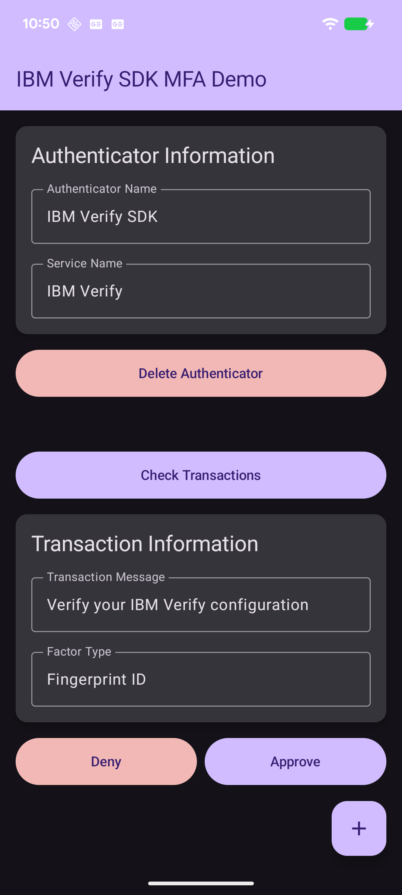

# IBM Verify SDK - MFA Demo App

A demonstration Android application showcasing the Multi-Factor Authentication (MFA) capabilities of the IBM Verify SDK.



## Overview

This demo app demonstrates how to integrate IBM Verify SDK's MFA functionality into an Android application. It showcases:

- QR code-based authenticator registration
- Transaction verification and approval
- Biometric authentication (UserPresence/Fingerprint)
- Multiple authenticator types (Cloud and On-Premise)
- Modern Material Design 3 UI with Jetpack Compose

## Features

### Core Functionality
- **QR Code Registration**: Scan QR codes to register new authenticators
- **Transaction Management**: Check for pending transactions and approve/deny them
- **Biometric Authentication**: Support for Face ID and Fingerprint authentication
- **Authenticator Management**: Delete registered authenticators
- **Persistent Storage**: Authenticator data is saved locally using SharedPreferences

## Building the Project

### 1. Clone the Repository

```bash
git clone https://github.com/ibm-verify/verify-sdk-android.git
cd verify-sdk-android
```

### 2. Open in Android Studio

1. Launch Android Studio
2. Select **File > Open**
3. Navigate to the project root directory
4. Click **OK**

### 3. Sync Gradle

Android Studio should automatically sync Gradle. If not:
1. Click **File > Sync Project with Gradle Files**
2. Wait for the sync to complete

### 4. Build the App

#### Using Android Studio:
1. Select **Build > Make Project** (or press `Ctrl+F9` / `Cmd+F9`)
2. Wait for the build to complete

#### Using Command Line:
```bash
# From the project root directory
./gradlew :examples:mfa_demo:assembleDebug
```

The APK will be generated at:
```
examples/mfa_demo/build/outputs/apk/debug/mfa_demo-debug.apk
```

## Running the App

### On a Physical Device:

1. Enable **Developer Options** on your Android device
2. Enable **USB Debugging**
3. Connect your device via USB
4. In Android Studio, select your device from the device dropdown
5. Click the **Run** button (or press `Shift+F10` / `Ctrl+R`)

### On an Emulator:

1. Open **AVD Manager** in Android Studio
2. Create a new virtual device (or use an existing one)
3. Start the emulator
4. Click the **Run** button in Android Studio

## Using the App

### 1. Register an Authenticator

1. Tap the **floating action button** (+ icon) in the bottom-right corner
2. Grant camera permission when prompted
3. Scan a valid IBM Verify QR code
4. Wait for registration to complete
5. The authenticator information will be displayed

### 2. Check for Transactions

1. Ensure an authenticator is registered
2. Tap the **"Check Transactions"** button
3. If a pending transaction exists, it will be displayed with:
   - Transaction message
   - Factor type required

### 3. Approve or Deny Transactions

1. After checking for transactions, if one is pending:
2. Tap **"Approve"** to verify the transaction
   - If biometric authentication is required, complete the biometric prompt
3. Tap **"Deny"** to reject the transaction
4. A success message will confirm the action

### 4. Delete an Authenticator

1. Tap the **"Delete Authenticator"** button (red button)
2. Confirm deletion in the dialog
3. The authenticator will be removed from local storage

## Additional Resources

- [IBM Verify SDK Documentation](https://github.com/ibm-verify/verify-sdk-android)
- [Jetpack Compose Documentation](https://developer.android.com/jetpack/compose)
- [Material Design 3](https://m3.material.io/)
- [Android Biometric Authentication](https://developer.android.com/training/sign-in/biometric-auth)
